SyR-e User Manual

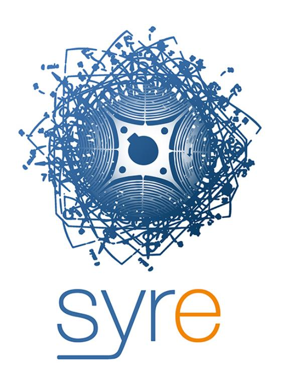

Simone Ferrari simone.ferrari@polito.it

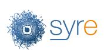

# Contents

| 1 |     | Introduction                                                     | 4  |  |  |  |  |
|---|-----|------------------------------------------------------------------|----|--|--|--|--|
|   | 1.1 | What is SyR-e?                                                   | 4  |  |  |  |  |
|   | 1.2 | Background                                                       | 4  |  |  |  |  |
| 2 |     | Getting Started                                                  | 6  |  |  |  |  |
|   | 2.1 | SyR-e Installation                                               | 6  |  |  |  |  |
|   | 2.2 | FEMM Installation                                                | 6  |  |  |  |  |
|   | 2.3 | XFEMM Solver                                                     | 6  |  |  |  |  |
|   | 2.4 | SyR-e File Format                                                | 6  |  |  |  |  |
|   | 2.5 | System Requirements                                              | 7  |  |  |  |  |
|   |     | 2.5.1 Matlab Version                                          | 7  |  |  |  |  |
|   |     | 2.5.2 Matlab Packages                                         | 7  |  |  |  |  |
|   |     | 2.5.3 Octave Version                                          | 7  |  |  |  |  |
|   |     | 2.5.4 FEMM Version                                            | 7  |  |  |  |  |
|   |     | 2.5.5 Back Compatibility                                      | 7  |  |  |  |  |
|   | 2.6 | Motor Examples                                                   | 8  |  |  |  |  |
|   | 2.7 | Utilities                                                        | 8  |  |  |  |  |
| 3 |     | Design eMotor with SyR-e                                         | 10 |  |  |  |  |
|   | 3.1 | Motor and Geometric Definitions                                  | 10 |  |  |  |  |
|   |     | 3.1.1 SyR Rotor Definitions                                   | 12 |  |  |  |  |
|   |     | 3.1.2 SPM Rotor Definitions                                   | 12 |  |  |  |  |
|   |     | 3.1.3 IPM V-type Rotor Definitions                            | 14 |  |  |  |  |
|   |     | 3.1.4 Induction Motor Rotor Definition                        | 14 |  |  |  |  |
|   |     | 3.1.5 Electrically-Excited Synchronous Motor Rotor Definition | 14 |  |  |  |  |
|   |     | 3.1.6 Custom Geometry Motor                                   | 14 |  |  |  |  |
|   |     | 3.1.7 Radial Geometrical Scaling                              | 15 |  |  |  |  |
|   | 3.2 | Winding Definition                                               | 15 |  |  |  |  |
|   |     | 3.2.1 Slot Model and AC Loss Simulation                       | 15 |  |  |  |  |
|   | 3.3 | Material Definition                                              | 15 |  |  |  |  |
|   | 3.4 | Thermal Parameters                                               | 15 |  |  |  |  |
|   | 3.5 | Structural Parameters 16                                      |    |  |  |  |  |
|   | 3.6 | Mesh Control 17                                               |    |  |  |  |  |
|   | 3.7 | Preliminary Design                                               | 17 |  |  |  |  |
|   |     | 3.7.1 (x,b) Design Plane and FEAfix                           | 17 |  |  |  |  |
|   |     | 3.7.2 PM Design                                               | 18 |  |  |  |  |

|   | 3.8 3.9                        | Design Optimization 18 Surrogate Model Dataset Computation 20 |  |  |  |  |  |  |
|---|-----------------------------------|------------------------------------------------------------------------|--|--|--|--|--|--|
| 4 |                                   | Simulate eMotor with SyR-e/FEMM 21                                  |  |  |  |  |  |  |
|   | 4.1                               | Static Magnetic Solver 22                                           |  |  |  |  |  |  |
|   | 4.2                               | Single Operating Point Simulation 22                                |  |  |  |  |  |  |
|   |                                   | 4.2.1 Custom Phase Currents 23                                   |  |  |  |  |  |  |
|   | 4.3                               | Flux Maps Evaluation 23                                             |  |  |  |  |  |  |
|   | 4.4                               | Iron Loss Evaluation 23                                             |  |  |  |  |  |  |
|   | 4.5                               | PM Motor Analysis 23                                                |  |  |  |  |  |  |
|   | 4.6                               | Short-Circuit Analysis 24                                           |  |  |  |  |  |  |
|   | 4.7                               | Specific FEA Analysis 24                                            |  |  |  |  |  |  |
|   | 4.8                               | Structural Analysis 25                                              |  |  |  |  |  |  |
| 5 |                                   | Export to other FEA Software 26                                     |  |  |  |  |  |  |
|   | 5.1                               | DXF Export 26                                                       |  |  |  |  |  |  |
|   | 5.2                               | SIMCENTER MagNet Export 26                                          |  |  |  |  |  |  |
|   | 5.3                               | Ansys Motor-CAD Export 26                                           |  |  |  |  |  |  |
|   | 5.4                               | Ansys Maxwell Export 26                                             |  |  |  |  |  |  |
|   | 5.5                               | JMAG Designer 27                                                    |  |  |  |  |  |  |
|   | 5.6                               | COMSOL Multiphysics 27                                              |  |  |  |  |  |  |
| 6 | Magnetic Model Manipulation 28 |                                                                        |  |  |  |  |  |  |
|   | 6.1                               | Getting Started with MMM GUI 28                                     |  |  |  |  |  |  |
|   |                                   | 6.1.1 Data Structure 29                                          |  |  |  |  |  |  |
|   |                                   | 6.1.2 New, Load, Save and Check Model 30                         |  |  |  |  |  |  |
|   |                                   | 6.1.3 Temperatures Manager 30                                    |  |  |  |  |  |  |
|   | 6.2                               | Load Data 31                                                        |  |  |  |  |  |  |
|   | 6.3                               | Simple Flux Maps Manipulation 31                                    |  |  |  |  |  |  |
|   |                                   | 6.3.1 Computation of the Control Trajectories 31                 |  |  |  |  |  |  |
|   |                                   | 6.3.2 Computation of the Inductance Maps 32                      |  |  |  |  |  |  |
|   |                                   | 6.3.3 Computation of the Inverse Model 32                        |  |  |  |  |  |  |
|   | 6.4                               | Scaling and Skewing Flux Maps 32                                    |  |  |  |  |  |  |
|   |                                   | 6.4.1 Motor Scaling 32                                           |  |  |  |  |  |  |
|   |                                   | 6.4.2 Motor Skewing 33                                           |  |  |  |  |  |  |
|   | 6.5                               | Torque-Speed Computations 33                                        |  |  |  |  |  |  |
|   |                                   | 6.5.1 Operating Limit Computation 33                             |  |  |  |  |  |  |
|   |                                   | 6.5.2 Efficiency Map Computation 34                              |  |  |  |  |  |  |
|   | 6.6                               | Export to Dynamic Model Simulator 34                                |  |  |  |  |  |  |
|   | 6.7                               | Waveform Computation 35                                             |  |  |  |  |  |  |
| 7 |                                   | Working without GUIs 36                                             |  |  |  |  |  |  |
|   | 7.1                               | Custom Features 37                                                  |  |  |  |  |  |  |
|   |                                   |                                                                        |  |  |  |  |  |  |
|   |                                   | 7.1.1 Single Point additional Post-Processing 37                 |  |  |  |  |  |  |
|   |                                   | 7.1.2 Automatic SyR-e Execution 37                               |  |  |  |  |  |  |
|   |                                   | 7.1.3 syrmDesignExplorer 37                                      |  |  |  |  |  |  |

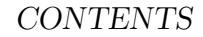

| 8 | Acknowledgements        | 38 |
|---|-------------------------|----|
| 9 | Contacts and References | 39 |

# Introduction

## 1.1 What is SyR-e?

SyR-e stands for Synchronous Reluctance – evolution and is an open-source code developed in Matlab/Octave. SyR-e can design synchronous reluctance machines automatically by means of finite element analysis and multi-objective optimization algorithms. SyR-e is available for download on [SourceForge](http://sourceforge.net/projects/syr-e/) and, from September 2020, on [GitHub.](https://github.com/SyR-e) The principle of operation of SyR-e is represented in Figure [1.1.](#page-5-0) From the first Graphical User Interface (GUI), it is possible to design an electrical machine with different methods (manually setting the geometric parameters, using pre-design procedures or through design optimization). The parametrized geometry is created in FEMM and several simulation routines are implemented behind this GUI. Once the design is final, flux maps can be computed and the machine can be imported in the MMM GUI, that execute all the machine model elaborations through maps and implements routines for the creation and simulations of drive models, included control algorithm.

## 1.2 Background

SyR-e is not a commercial software and therefore no technical support is guaranteed. This User Guide gives to the reader the basic information so to allow a first use of SyR-e but it is not intended as a designer manual. SyR-e has been developed over the last years and used to realize several designs and prototypes. The reader is encouraged to refer to related literature for more technical details on the design of synchronous reluctance machines. The origin of SyR-e, dated back in 2009, was motivated by a twofold vision:

- to investigate SyR rotor geometries with no prejudices from the existing literature;
- to provide an automatic design tool to non-expert designers.

These two aspects are still the foundation of the current release, although the work in between has demonstrated that the SyR-e designed geometries are quite consistent

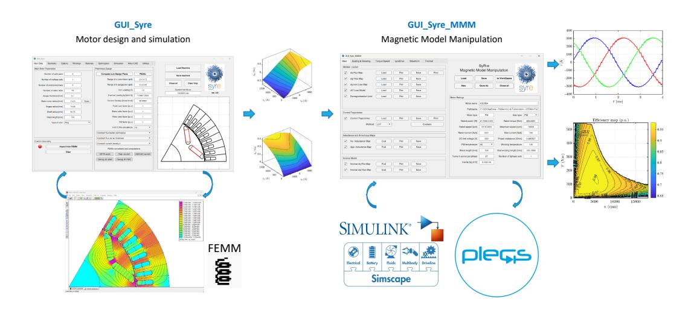

Figure 1.1: SyR-e geography and data workflow.

with the previous literature. To summarize the work done so far, different multiobjective optimization algorithms (MOOA) have been compared. It was shown that multi objective differential evolution (MODE) can guarantee superior performances in terms of speed of convergence and quality of the result when compared with other state-of-the-art algorithms. The current SyR-e distribution embeds an open-source version of the MODE algorithm, but this can be easily substituted with any other algorithm provided that it runs in Matlab/Octave and it is configured to manage the same input/output variables. Originally, the first version of SyR-e can design only two types of rotor barriers: the circular ones and the segmented ones. In the latest versions, other geometries are added, as the Fluid geometry, the SPM motors and Vtype IPM motors, Induction Machines (IMs) and Electrically-Excited Synchronous Machines (EESM).

# Getting Started

## 2.1 SyR-e Installation

To use SyR-e, the code must be downloaded from one of the repositories and unzipped. The Matlab or Octave path must be the unzipped folder. SyR-e is equipped with two grapchical user interfaces (GUIs): one for the design and FEA analysis (main GUI) and the other for magnetic model manipulation (identified with the acronym MMM). To use SyR-e it is just necessary to launch from Matlab one of the two GUI, realized with Matlab AppDesigner.

## 2.2 FEMM Installation

SyR-e requires FEMM [\(link\)](https://www.femm.info/wiki/HomePage) for the FEA simulations, including OctaveFEMM. This is installed automatically with FEMM, typically in the directory

'C:\femm42\mfiles\'.

This path is automatically added from SyR-e to the Matlab/Octave path once launching one of the GUI, or with the function setupPath. If FEMM in installed in other folders, it is necessary to manually add the folder to Matlab/Octave path.

## 2.3 XFEMM Solver

From v26.1, SyR-e partially support XFEMM, available [here.](https://github.com/crobarcro/xfemm) The FEA model creation remains not supported, while the simulation of a already-created .fem file is possible. XFEMM was introduced [here](https://doi.org/10.1109/ICELMACH.2016.7732685) and a version with some bugs corrected for SyR-e and the MEX files already compiled for Windows and Linux platform is included among the syreCustomFeatures files.

## 2.4 SyR-e File Format

SyR-e save two files each motor motorname.mat and motorname.fem. The former contains all the information of the motor, regarding the geometry, ratings, performance, materials,. . . while the latter is the FEMM model, with the geometry of the motor.

#### 2.5 System Requirements

The system requirements can be checked launching the function checkRelease(). For convenience, they are reported also in the following.

#### 2.5.1 Matlab Version

Actual Matlab version adopted for SyR-e development is the 2025b. SyR-e can operate with Matlab versions not older than 2021b, because of compatibility with Matlab GUI tool (AppDesigner). For previous versions, some problems can arise.

#### 2.5.2 Matlab Packages

To use all the capabilities of SyR-e, this Matlab packages are suggested:

- Simulink: dynamic model simulations (syreDrive);
- Simscape and Simscape Electrical: dynamic model simulations (syreDrive);
- Parallel Computing Toolbox: for the parallel computing of FEA simulations;
- PDE Toolbox: structural analysis and mass computation;
- Curve Fitting Toolbox: used for some post-processing;
- Statistic and Machine Learning Toolbox: used for the creation of training dataset for data-driven models.

#### 2.5.3 Octave Version

Among the Octave distributions, the one which was tested with SyR-e is Octave UPM (Politechnic University of Madrid). Octave UPM is a customized version of GNU Octave compiled with GUI.

#### 2.5.4 FEMM Version

It is suggested to operate with the last FEMM version available. At the time of this document, the last version available is the one released 21Apr2019. Older version than the 25Feb2018 cannot be used.

#### 2.5.5 Back Compatibility

In general, back-compatibility of the SyR-e files is guaranteed. Once the old project is loaded in one of the GUIs, a back-compatibility check is performed, and the missing information are added. It is hardly suggested to save the motor, in order to have an updated project.

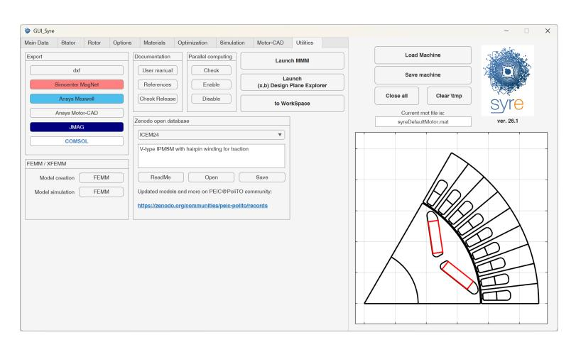

Figure 2.1: Utilities tab of SyR-e GUI

## 2.6 Motor Examples

In the SyR-e path it is included the folder motorExamples, with three examples of motors (complete with flux maps), designed with SyR-e. They are:

- syreDefaultMotor: it is an IPM motor based on Tesla Model 3 traction motor and it is the default example.
- mot 01: it is a SyR motor, and was the past default SyR-e motor.
- RAWP: it is a SyR motor designed from an induction motor stator. Further information on this motor can be found [here.](http://hdl.handle.net/11583/2771413 )
- THOR: it is a PM-SyR motor, with custom geometry loaded (originally used an old SyR-e parametrization). Further details on the motor can be found [here.](http://hdl.handle.net/11583/2758652 )
- TeslaModel3 custom: it is a IPM V-type motor similar to the rear axle emotor of Tesla Model 3 electric car. It uses custom geometry, with the rotor cross-section retrieved from available online pictures.
- PEIC PM V12: V-type IPM machine with asymmetric 12-phase winding, designed for multi-phase machine testing.

Additional motor examples can be found on Zenodo and are accessible from the Utilities tab of the main SyR-e GUI.

## 2.7 Utilities

On the main GUI there is a tab (reported in Figure [2.1\)](#page-8-2) related to some useful links. These utilities are:

Export of the motor model to dxf file or other commercial FEA softwares.

- Check of the minimum system requirements in terms of Matlab version and toolboxes and FEMM version.
- Control of the parallel pool.
- Link to the SyR-e documentation and references.
- Link to the MMM GUI.
- Link to syrmDesignExplorer.
- Select FEMM or XFEMM solver.
- Link with Zenodo page with additional motor models.

# Design eMotor with SyR-e

In the following, the operation with GUI (and so Matlab) will be illustrated. Besides the availability of the GUIs, it is always possible to work without GUI, both for Matlab and Octave users. Some glimpse of non-GUI operations will be given in the last sections of this document. To design an eMotor with SyR-e the main GUI must be launched, with the command GUI Syre. This GUI is divided into 8 tabs, dedicated for precise operations (that will be described in the following). When the GUI is launched, a default motor is loaded.

## 3.1 Motor and Geometric Definitions

The main parameters of the motor and the stator and rotor geometric definitions are done with the first two tab of the GUI, reported in Figure [3.1](#page-10-2) and Figure [3.2.](#page-11-0)

In the main tab is possible to define main motor quantities, like number of pole pairs, number of stator slots, stator, rotor and shaft radius, airgap and stack length and motor type. The available motor types are:

- Circular
- Seg

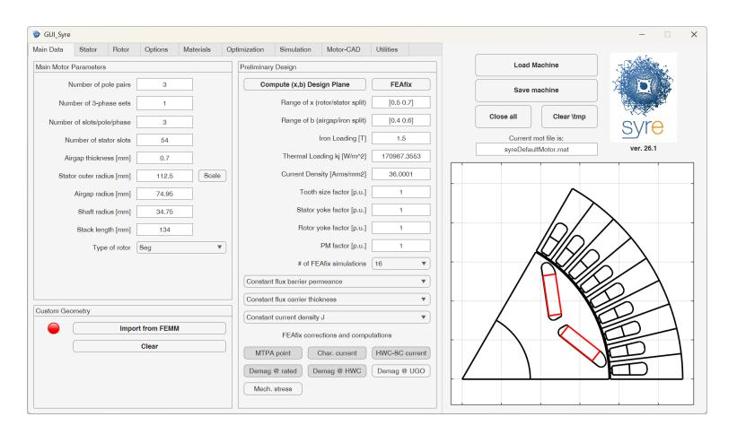

Figure 3.1: Main tab of SyR-e GUI

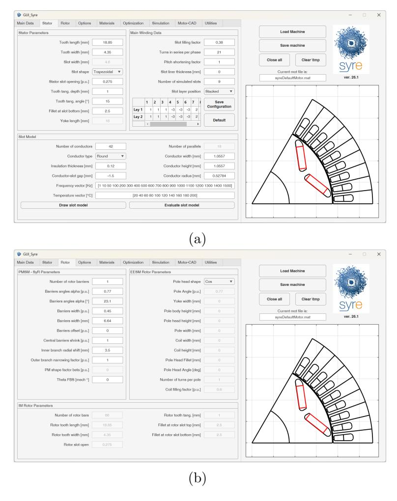

Figure 3.2: Stator and rotor geometry tab of SyR-e GUI

- ISeg (not recommended for new projects, use Seg geometry with modified parameters)
- Fluid
- SPM
- V-type (not recommended for new projects, use Seg geometry with modified parameters)
- IM
- EESM

The first four are for SyR and PM-SyR motors and will generate motors with SyR dq axis convention (PMs along the −q axis), while SPM and V-type will generate motors with PM motor dq axis convention (PMs along the +d axis). Moreover, it is possible to change the axis convention from the Simulation tab.

Stator and rotor dimensions are defined in the second tab of the main GUI, reported in Figure [3.2.](#page-11-0) The stator definition is quite common, while for rotor def-

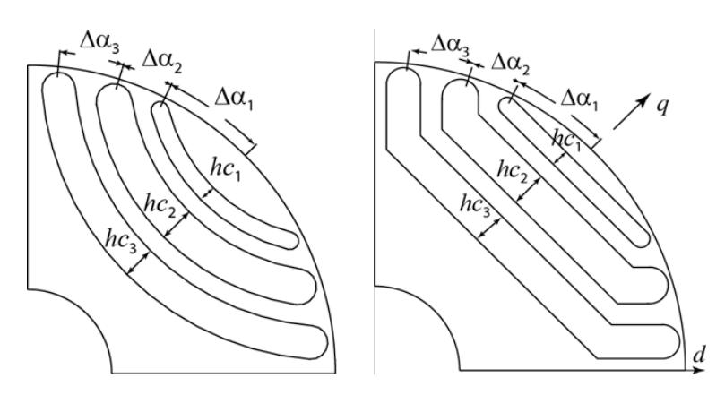

Figure 3.3: Definition of the rotor barrier position aong the airgap and the barrier thickness

inition, the p.u. framework is adopted, and some input changes based on the type of selected rotor.

#### 3.1.1 SyR Rotor Definitions

The main parameters for SyR rotors are the number of flux barriers, their position along the airgap and the barrier thickness, defined according to Figure [3.3.](#page-12-2) Please note that the barriers are numbered from the outer to the inner.

Other parameters include:

- Barrier offset, defined in p.u. and represent a shift of the barriers along the q-axis, as described in Figure [3.4](#page-13-0)
- Central barrier shrink, expressed in p.u. allows to transform a Seg geometry to a V-type geometry (when set to 1)
- Inner branch radial shift in mm, allows to create "deep" flux barriers, without moving the barriers edges
- Outer branch narrowing factor in p.u, allows to reduce the thickness of the outer branch of the Seg barriers
- FBS angle, expressed in mechanical degrees allows to make the rotor asymmetric and reduce torque ripple (see [here](http://hdl.handle.net/11583/2712425) and [here](http://hdl.handle.net/11583/2758652) for details)

#### 3.1.2 SPM Rotor Definitions

For SPM rotors, the input are the PM angular span (expressed in electrical degrees) and the PM thickness. Additional parameters are the number of PM segment along the circumference, that allows to discriminate between parallel and radial magnetization as depicted in Figure [3.5,](#page-13-1) and the PM shape factor, expressed in p.u., that allows to change the PM thickness as shown in Figure [3.6.](#page-13-2)

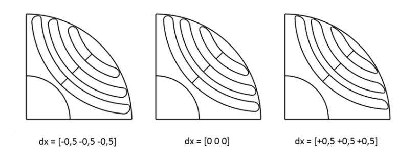

Figure 3.4: Definition of the flux barrier shift

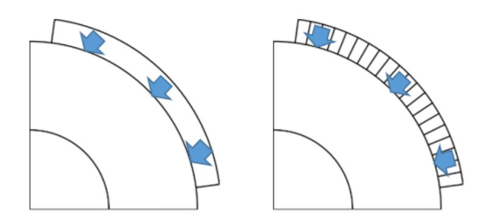

Figure 3.5: Difference between parallel (left) and radial (right) PM magnetization

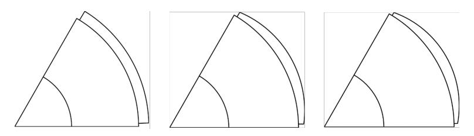

Figure 3.6: Effect of PM shaping factor, equal to 1 / 0.5 / 0.33 from left to right

#### 3.1.3 IPM V-type Rotor Definitions

For the V-type rotor, similar parametrization of SyR motor are followed. The only big difference is the definition of PM shape factor, that change the PM angle, going from a straight magnet if PM shape factor is zero, to PMs parallel to pole limit if PM shape factor is equal to one. Further information can be found in the 2019 07 22 - IPM Vtype geometry parameters.pptx.

This geometry is going to be dismissed. The suggestion is to create V-type IPM motors is to use Seg geometry, imposing Central Barrier Shrink=ones(1,nlay) (see TeslaModel3 custom and syreDefaultMotor motors model).

#### 3.1.4 Induction Motor Rotor Definition

Induction motors are added to SyR-e, at the moment just for simulation purposes and without design equations. The stator is defined as for synchronous machines, while the rotor geometry has a dedicated tab, where is possible to define number of rotor bars and slot and tooth dimensions. Dealing with simulations, just single points and flux maps are supported (with the IM controlled in Field Oriented Control).

#### 3.1.5 Electrically-Excited Synchronous Motor Rotor Definition

Electrically-Excited Synchronous Machines are added to SyR-e and development on the integration of this machine in the toolchain is ongoing. At the moment, it is possible to create the motor and simulate with single point simulation. Improvements on additional simulations, preliminary design and optimization are ongoing.

## 3.1.6 Custom Geometry Motor

Besides the parametric definition of the geometry, SyR-e allows the simulation of custom rotor geometry. To do so, the steps are:

- Create and save a SyR-e motor as close as possible to the custom geometry, in order to have the material blocks setted correctly in FEMM
- Open the FEMM project and modify the geometry. DXF file is possible to import, but be careful about the boundary condition setting, winding settings and material settings
- Once the FEMM file is saved, it is possible to push the button Import from FEMM in the main tab. Once import is completed, the led will be green and the custom motor geometry will be colored on the SyR-e GUI. Examples of a custom geometry are THOR and TeslaModel3 custom motors in the motorExamples folder.

#### 3.1.7 Radial Geometrical Scaling

SyR-e allows an easy radial scaling of the motor by using the button Scale close to the stator outer radius input. If this button is enabled, it is possible to change the outer radius and all the radial dimensions will scale accordingly.

#### 3.2 Winding Definition

The windings are defined in the stator tab. The winding is automatically generated thanks to a custom Koil version, realized for SyR-e. Multi-three-phase motors can be realized by changing the number of three-phase sets. In this case, the number of slots per pole pair in the main tab must be adjusted. It is possible to change the number of simulated slots and have custom winding by changing the winding definition in the tab and then the button Save Configuration. The numbers define the phase on each layer and each slot, while the sign define the current direction.

#### 3.2.1 Slot Model and AC Loss Simulation

In the bottom of the tab there is the section related to slot model and AC loss factor computation. It is possible to set the shape and number of conductor to fit in the slot, starting from the slot filling factor, or set the slot filling factor equal to NaN and set the conductor number and dimensions. The model will be created in FEMM (Time Harmonic solver) and can be computed for a matrix of frequency and temperature, defined from the proper inputs. Parallel computing is adopted by default.

## 3.3 Material Definition

Materials are defined in the respective tab, reported in Figure [3.7.](#page-16-1) It is possible to define the material for the different sections of the motor. With the green and red buttons is possible to add or remove materials for each class (iron, conductor, magnet and sleeve) and with the blue button it is possible to see the material properties. Motor mass and rotor inertia is computed according to material properties and geometry.

## 3.4 Thermal Parameters

Thermal parameters are included in the top section of the Options tab of the main GUI, reported in Figure [3.8.](#page-16-2) It is possible to use three different inputs to compute the rated current: thermal loading kj [W/m2 ], rated loss [W] and RMS slot current density J [A/mm2 ]. One quantity is the input and the other are computed online. Together with this, housing temperature and target average winging temperature must be set. With this data, a simple lumped parameters thermal model (see [here](http://hdl.handle.net/11583/2694501) for reference) computes the winding temperature and the rated current to get the target thermal loading. A similar approach is followed for the rotor circuit of EESM,

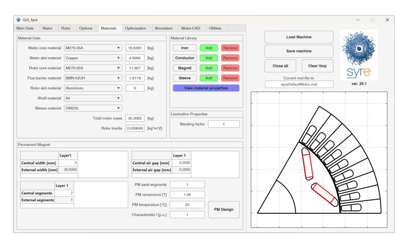

Figure 3.7: Materials tab of the main GUI

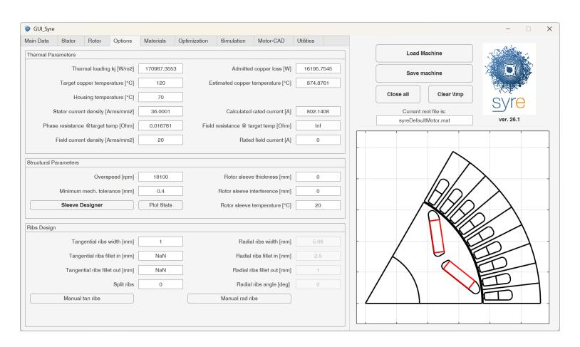

Figure 3.8: Options tab of the main GUI

with the possibility to impose current density or field current. No thermal models are developed in this case.

## 3.5 Structural Parameters

SyR-e embeds also a simple structural model adopted during the design. The two main structural parameters are the overspeed and the minimum mechanical tolerance, all reported in a dedicate window in the Options tab. It is possible to include also rotor sleeve, by imposing its thickness (and eventually design a rib-less motor). An analytical model based on parametric plane is available for the preliminary design.

At the bottom of this tab there is also the ribs design windows. There is possible to define the thickness of the tangential and radial ribs (neglecting the overspeed parameters), decide if the radial ribs must be split (just for Seg geometry) and change fillets and inclination of the ribs.

|                         | During Optimization    | During Post-Processing            |
|-------------------------|------------------------|-----------------------------------|
| General mesh resolution | $\frac{Mesh\_MOOA}{p}$ | $\frac{Mesh}{p}$                  |
| Airgap mesh resolution  | $\frac{1}{p}$          | $\frac{Mesh}{p \cdot Mesh\_MOOA}$ |

#### 3.6 Mesh Control

The mesh size control for FEMM is done through two parameters in the Simulation tab: Mesh and Mesh\_MOOA. The mesh is defined in a different way for the airgap and if the optimization is running or not. The detail of the mesh resolution is reported in Table 3.1.

Furthermore, the mesh of the structural model can be controlled by an additional parameter. For structural simulation it is possible to use the same mesh of FEMM or a different mesh (finer, generated by FEMM or generated by Matlab tools).

## 3.7 Preliminary Design

There are three tools that can be adopted for preliminary design: Compute the (x,b) Design Plane and FEAfix buttons (in the main tab) and PM Design (in the material tab).

#### 3.7.1 (x,b) Design Plane and FEAfix

This tool was originally created for the SyR motors design at constant iron flux density and thermal loading. It allows to compute a design plane where torque and power factor are plotted function of two dimensionless parameters. Each point on this design plane represent a different motor and it is possible to select the best design, based on the target performance and the inputs. In the years, the approach is improved, adding the FEAfix button, that allows to correct the analytical equations at the base of the design plane with few selected FEA simulations (the number of FEA simulations is selectable from the GUI). Further details can be found here. The last improvement deals with the PM motors, and the extension of the syrmDesign/FEAfix approach for PM-SyR and IPM machines.

The design options that can be selected from the GUI are:

- flux barrier design: select if all the barriers must have the same thickness (useful for PM-SyR motors) or have same permeance (suggested for SyR motors);
- flux carrier design: select how to split the rotor iron thickness, if with  $\Delta x = 0$ , have constant flux carrier thickness, or thickness proportional to sine wave;
- select the thermal input, if the design plane is obtained with constant  $k_j$  or constant J;
- correct the current angle during the FEAfix process searching for the MTPA:
- compute the characteristic current (just PM motors);

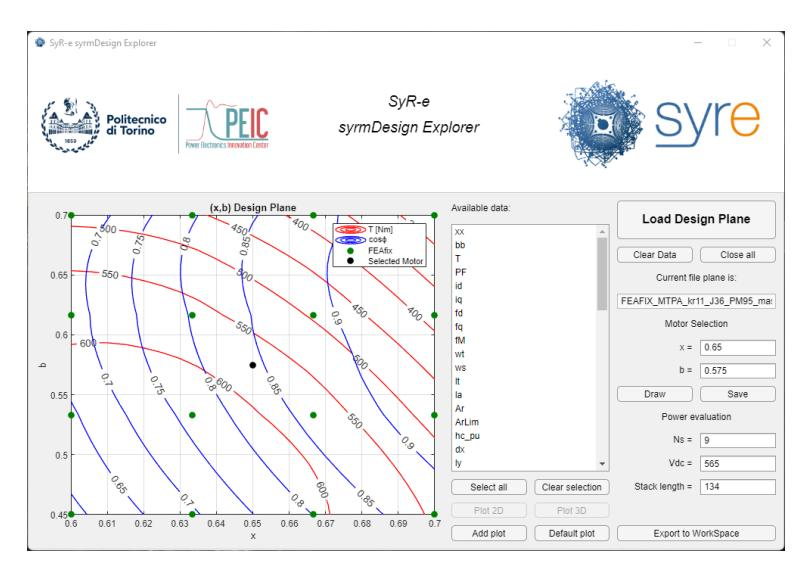

Figure 3.9: Graphical User Interface of syrmDesignExplorer tool

- compute the HWC short-circuit current (just PM motors);
- compute the volume of PM irreversibly demagnetized at maximum operating and/or HWC current.

The result of the syrmDesign/FEAfix evaluation is the picture of the design plane, that include more data than the plotted. It is possible to open this figures with the syrmDesignExplorer GUI, reported in Fig. [3.9](#page-18-2) and see all the performance figures computed from the model, select new motors and scale the design plane (length and turns).

## 3.7.2 PM Design

This procedure allows to design the PMs of PM-SyR and V-type motors targeting a defined characteristic current. The tool is on the bottom of the Material tab and allows to manually change the PM size or automatically design the PM sizes, with a FEA iterative procedure described [here.](http://hdl.handle.net/11583/2758652)

## 3.8 Design Optimization

The design optimization is performed with MODE algorithm and is setup in the Optimization tab, reported in Figure [3.10.](#page-19-0) The tab is divided into 2 subtabs. On the former, simulation setup are available and the list of optimization objectives, while from the latter it is possible to select the optimization variables and their boundaries.

Dealing with the optimization process, can be carried out at constant thermal loading (i.e. constant copper loss, since the stator outer radius is constant), constant current density or constant phase current (i.e. Ampere-turns, as number of turns is imposed). The current angle can be included in the optimization variables, in this way the MTPA is automatically found during optimization. To improve the

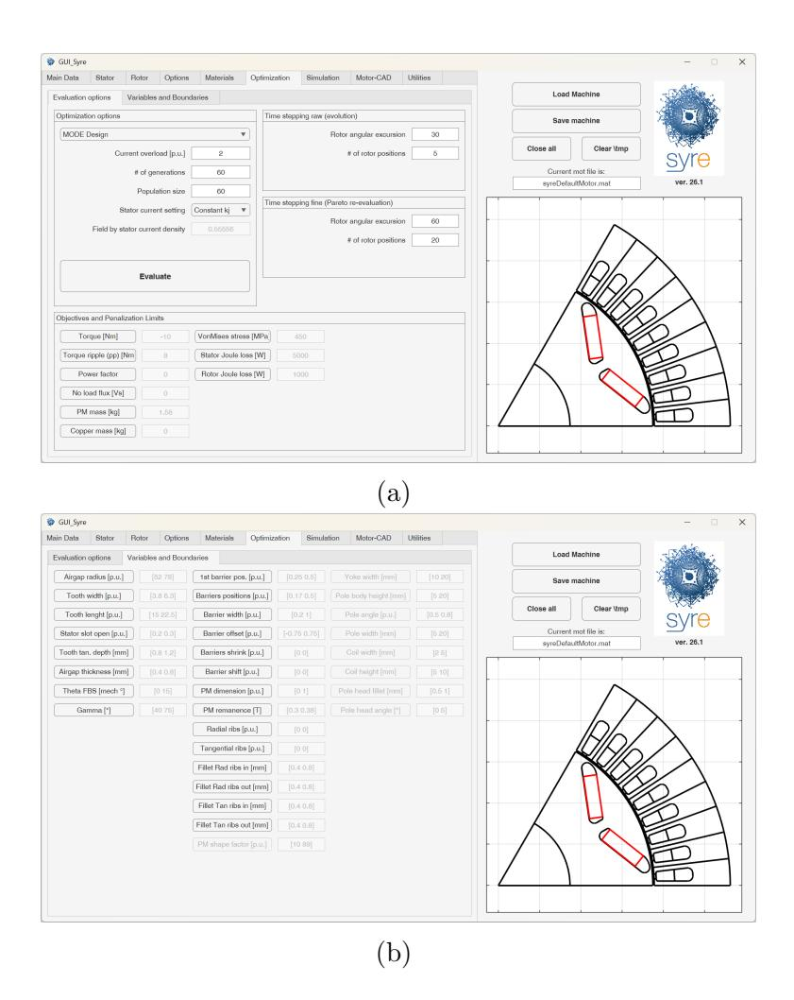

Figure 3.10: Optimization tab of the main GUI.

convergency, penalization is done on the quantities that are bigger than some limits, defined as penalization limits. If the limit is negative, the respective quantity is maximized (example: minimization of minus maximum torque), while if the penalization limit is positive, the quantity is minimized (torque ripple). Details on optimization can be found, for example [here](http://hdl.handle.net/11583/2582959) and [here.](http://hdl.handle.net/11583/2694501) The results of the optimization are saved in the results folder as a file and one folder containing all the motors on the Pareto front of the optimization.

It is possible to perform a structural check on each motor, by enabling the Mechanical Stress Control. This add a further objective related to structural simulations, that penalize the structurally-weak motors.

A last parameter is the optimization type. Selecting Design, the design space will be explored, while the mode Refine, the optimization variables will change around the actual motor parameters.

## 3.9 Surrogate Model Dataset Computation

The simulation toolchain used for the multi-objective FEA optimization can be adopted to compute dataset for surrogate model creation. Two sampling methods are included (Latin Hypercube and Sobol sampling) and the objectives and variables can be selected as for optimization. In addition, structural index (computed with SyR-e routine and PDE model) and thermal index (computed with 3D thermal FEA developed from UniPD team) are added in the dataset. This feature is added for the Galileo Ferraris Contest [\(link to the web page\)](https://github.com/cadema-PoliTO/GalFer_contest/tree/main).

# Simulate eMotor with SyR-e/FEMM

The main FEA simulation engine adopted with SyR-e is FEMM. The FEA simulations are controlled from the Simulation tab of the main GUI, reported in Figure [4.1.](#page-21-1)

The first two inputs are related to the definition of the FEA simulation and the time stepping solver, while the other inputs can be enabled or disabled based on the Evaluation type selection. The possible FEA simulations are:

- Single Point
- Flux Map
- Characteristic Current
- Steady-State Short-Circuit Current
- HWC Short-Circuit Current
- Demagnetization Curve
- Demagnetization Curve DQ

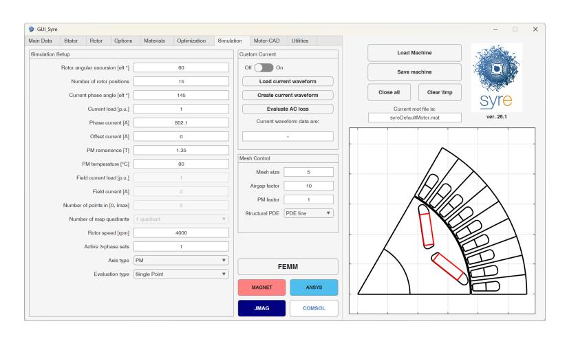

Figure 4.1: Simulation tab of the main GUI

- Demagnetization Analysis
- Flux Density Analysis
- Current Offset
- Airgap Force
- Iron Loss – Single Point
- Iron Loss – Flux Map
- Structural Analysis

It is possible to select also the axis type convention used for FEA simulations. There are two possible choices:

- SR: typical of SyR motors, with the (possible) PM flux linkage aligned along the −q axis;
- PM : typical of PM motors, with the (possible) PM flux linkage aligned along the d axis.

For multi-three-phase motor, it is possible to activate / de-activate each single 3-phase sets with the input Active 3-phase sets (1 means that the set is active, 0 means that the set is open).

## 4.1 Static Magnetic Solver

The FEA simulation are performed in FEMM with a static magnetic solver. The rotor movement is emulated by running several simulations at different rotor position, emulating a continuous rotor rotation. Phase currents are imposed in accordance to rotor position and the input dq currents. The trade-off between accuracy and computational time is done by selecting a proper angular span of the rotation and the number of rotor position that must be simulated. Usually, for standard three-phase distributed winding motors, 60 electrical degrees rotation is enough (symmetry are exploited) and 30 rotor positions gives good harmonic resolution, while 6 rotor positions can get the average values.

## 4.2 Single Operating Point Simulation

The simplest FEA simulation is the single point simulation. It consists in the evaluation of a single (id, iq) point, defined from current amplitude (in p.u. of the rated current) and current angle, computed from the d-axis. The results folder is named T eval xxAx xxdxx xxdeg with information of current amplitude, current angle and PM temperature (substitute "xx" with numbers). It is possible to input a vector of current amplitude and angles, running a sensitivity analysis (with parallel computing). In this case, an additional result folder will be created with the vectors resulting from this analysis. The name of the result folder is senseOut yyyymmddThhmmss with information of date and time of the simulation.

#### 4.2.1 Custom Phase Currents

It is possible to simulate custom phase currents (with current ripple from inverter, for example), by loading a proper file with the current waveform. This file should include 4 variables: ia, ib, ic and th, that are the phase currents and rotor position in one electrical period. This applies also for iron loss computation.

## 4.3 Flux Maps Evaluation

In this case the flux and torque maps over a regular (id, iq) domain are computed. The domain is defined with current amplitude and number of current levels (valid for both axes). It is possible also to select the number of quadrants to simulate: 1, 2 or 4. The simulated quadrant change based on the rotor geometry:

- Circular, Seg, ISeg, Fluid use the SyR convention, so:
  - 1Q: id > 0 / iq > 0
  - 2Q: id > 0
  - 4Q: full plane
- SPM and V-type use PM motor convention, so:
  - 1Q: id < 0 / iq > 0
  - 2Q: iq > 0
  - 4Q: full plane

The results folder is named F map nnAnxnnAn xxdeg nQ, with indication of the current limits, PM temperature and number of quadrants (change n). with numbers).

## 4.4 Iron Loss Evaluation

Iron loss can be computed for single point or flux maps. For both cases, the folder name is the same of other cases, with ironLoss at the end. Iron loss are computed in FEMM by simulating the complete rotation and with good number of rotor positions. All the mesh data for each simulation must be downloaded from FEMM, so the computational time is relevant. The results are the stator and rotor hysteresis and eddy-current iron loss, and the PM loss, for a given simulation speed. The modified Steinmetz equation are adopted. Further information on the iron loss computation in SyR-e can be found [here.](http://hdl.handle.net/11583/2901412)

## 4.5 PM Motor Analysis

The PM motor analysis includes three types of simulations in SyR-e, specifically intended for PM motors. They are:

- Computation of the characteristic current function of the PM temperature
- Computation of the demagnetization current function of the PM temperature
- Check of demagnetized area for a given demagnetizing current and PM temperature

The first two analysis are based on iterative procedures, described [here.](http://hdl.handle.net/11583/2836788)

Dealing with the demagnetization analysis, all the mesh nodes of the PMs are imported in Matlab and the flux density along the magnetization direction is considered. To assess the demagnetization limit, 1% of the PM volume demagnetized is tolerated.

## 4.6 Short-Circuit Analysis

Two types of analysis can be performed for the short-circuit parameters.

The former (HWC current) allows to estimate the peak short-circuit current that could occur during three-phase symmetric short-circuit. This estimation is identified with the acronym HWC that stands for "Hyper-Worst-Case", because phase resistance and all the other loss terms are neglected. The HWC current is function of the pre-fault point, that is the input of the analysis. After the single point simulation is performed, the HWC current is found with an iterative process (details available [here\)](http://hdl.handle.net/11583/2940061). Also in this case, it is possible to input a vector of current amplitude-angle, so several pre-fault conditions are considered (reducing the number of iterations).

A second option is added and allows to compute the steady-state short-circuit current by iteratively searching for the idq point that make the flux linkage null in the faulted set. This additional feature is useless for three-phase machines, as the steadystate short-circuit current can be approximated with the characteristic current, but is fundamental in the analysis of multi-three-phase machines fault scenarios, when one set can be short-circuited (i.e. flag 0 in the corresponding vector) and the other sets can be supplied with the healthy case current.

## 4.7 Specific FEA Analysis

Some other specific FEA analysis can be carried out. They consist of a single point operation, with additional inputs or output and include:

- Flux density analysis: the waveform of airgap, tooth and yoke flux densities for each rotor position simulated are exported
- Current offset simulation: allows to run the FEA simulation with a phase current offset (homopolar current) of 10% of the current amplitude
- Airgap force computation: exports also the radial force along the airgap and compute the NVH sources.

## 4.8 Structural Analysis

Structural analysis is performed using the PDE Toolbox in Matlab and is still under development. The only input is the rotor speed, while mesh and boundary conditions are automatically set. All the rotor structure is modeled as a unique body, with material properties adapted if the region in steel, PMs, rotor bars or sleeve. For PMs and rotor bars, the Young's module is set as 1 100 of steel Young's module to avoid structural support of this sections.

The mesh size can be controlled by the dedicated parameter, while the boundary condition is set to have zero displacement along the shaft surface and sliding boundary condition along the pole sides. The motor is modeled as a unique body, so it PMs are included, the specific gaps must be drawn.

Dealing with rotor sleeve, the simulation is still under development and validation against more complex FEA solvers.

The rotor geometry is loaded from FEMM, allowing structural validation also for custom geometries.

## Export to other FEA Software

The export to other (commercial) FEA software is possible, with some limitations on the possible simulations to be performed.

#### 5.1 DXF Export

SyR-e support the export to dxf file, through the function <code>syreToDxf()</code>. The motor file can be selected and the dxf geometry is exported in a new file. Please, note that just the geometry is exported, and not boundary definitions, blocks definitions, materials, and so on.

## 5.2 SIMCENTER MagNet Export

The export to Simcenter MagNet is almost fully supported, through the GUI. There are two red buttons, close to *Save* button and to *Start* simulation button, named MN. These two commands allows the export and simulation in Simcenter Magnet respectively. In this case, the FEA model is completely set-up (i.e. materials, windings, boundaries,:.) and the *Transient with Motion* simulation is performed, mainly to get iron loss.

#### 5.3 Ansys Motor-CAD Export

Ansys Motor-CAD export is managed from the relative tab in the main GUI, reported in Figure 5.1. Also in this case, the model is completely set-up, and it is possible to run both electromagnetic and thermal simulations.

## 5.4 Ansys Maxwell Export

The export in Ansys Maxwell works is at the very first development stage. In principle, it works as Simcenter MagNet export, with dedicated buttons (*Ansys*, in blue) to save the model and launch FEA simulations. Since it is at the very beginning development stage, not all the simulations can be performed in Ansys

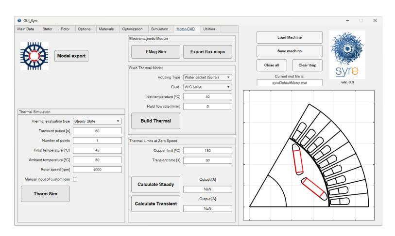

Figure 5.1: Motor-CAD tab in main GUI

Maxwell from SyR-e, but it is always possible to launch the FEA model outside the SyR-e environment.

## 5.5 JMAG Designer

The export with JMAG designer works in a similar way that the other software. Single point simulations and flux maps are supported.

#### 5.6 COMSOL Multiphysics

The export and simulation with COMSOL is at its first release. The interface is developed through the Matlab-COMSOL LiveLink and the supported simulations are single point (electromagnetic) and strucutral. At the moment, standard motors are supported.

# Magnetic Model Manipulation

The routines for the manipulation of the flux maps was included in SyR-e from its first release. However, there was a collection of scripts without an intuitive interface to operate and deeply understand their working. In April 2020, a second GUI of the SyR-e project is released, ruling and organizing the flux maps elaboration routines and an easy and understandable method to operate with motor model.

This GUI is identified with the acronym MMM, that stands for Magnetic Model Manipulation. From the MMM GUI there is not possible to launch FEA simulations, but just load simulated data and post-process them.

## 6.1 Getting Started with MMM GUI

The MMM GUI is launched with the command GUI Syre MMM. The GUI is composed of 6 tabs:

- Main: used to load models and do simple manipulations, like inverse maps, control trajectories computation, ...
- Scale & Skew: used to compute flux maps of scaled and skewed motors;
- Torque-Speed: used to compute the characteristic in the torque-speed domain;
- syreDrive: interface with Simulink and the dynamic model simulation;
- Waveform: used to compute waveform as single working point (from dqθ maps) and transient short-circuit;
- Thermal: used to compute thermal limits (under development).

The main window of MMM GUI is reported in Figure [6.1.](#page-29-1) On the right a table with the motor rating is reported and always visible, while on the right top of the GUI, there are the buttons to load and save models.

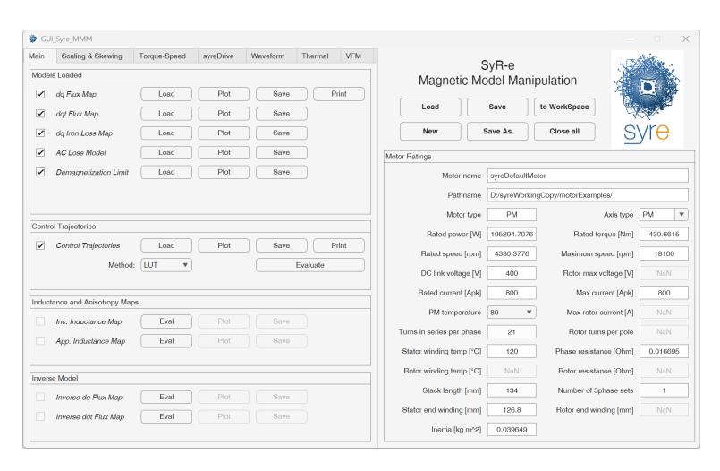

Figure 6.1: Main window of the MMM GUI

#### 6.1.1 Data Structure

The main data structure behind the MMM procedures is called motorModel and it is saved in the motor .mat file from the MMM GUI (not from the main GUI!). The motorModel structure is composed from different substructures, that can be empty if the respective model in not loaded. They are:

- data: contains the ratings of the motor;
- FluxMap dq: contains the flux maps of the motor in the dq domain (fundamental model);
- FluxMap dqt: contains the dqθ flux maps of the motor, so function of dq currents and rotor position;
- IronPMLossMap dq: contains the iron loss and PM loss maps, function of dq current and at given speed, with also the coefficients to scale in speed;
- acLossFactor: contains the AC loss factor, function of temperature and frequency;
- DemagnetizatioLimit: contains the demagnetization limit function of the PM temperature;
- controlTrajectories: contains the control trajectories, like Maximum Torque per Ampere (MTPA), Maximum Torque per Voltage (MTPV), and so on;
- IncInductanceMap dq: contains the incremental inductance maps, useful for the control system simulation;
- AppInductanceMap dq: contains the apparent inductance maps, useful for the control system simulation;
- FluxMapInv dq: contains the inverse flux maps in the dq domain, so currents and torque function of dq flux linkages;

- FluxMapInv dqt: contains the inverse flux maps in the dqθ domain;
- TnSetup: contains the set-up for the torque-speed evaluations, so operative limits and efficiency maps;
- SyreDrive: contains the setup for syreDrive, the export to dynamic model simulation;
- WaveformSetup: contains the setup for the extraction of waveform from dqθ model and transient short-circuit computation;
- tmpScale: contains the scaling factor, used during the scaling procedure;
- tmpSkew: contains the data for skewing, used during the skewing procedure;
- Thermal: contains the data for thermal computation (under development);
- PMtempModels: contains the flux and loss maps at temperatures different from the selected one.

#### 6.1.2 New, Load, Save and Check Model

The main model operations are done with the buttons at the top right of the GUI. There is six operations that could be done:

- Load: load a new motor model. The target is load the .mat file of the motor, and eventually add flux maps and other manipulations.
- New: allows to create an empty motorModel structure, useful if experimental flux maps must be loaded and post-processed, and in general, if the SyR-e file is not available.
- Save: allows to update the current motor file with the motorModel structure.
- Save As: allows to save the motor model, with the motorModel structure. New file must be created.
- to WorkSpace: load the actual motorModel structure on the Matlab WorkSpace.
- Close all: close all the figures.

#### 6.1.3 Temperatures Manager

It is possible to manage flux maps at different PM temperatures thanks to the PM temperature selector in the ratings section. Usually, a primary PM temperature is considered for the motorModel structure, but the flux and loss maps at different PM temperature are stored in the motorModel.PMtempModels structure, allowing to load in the primary level of motorModel the PM temperature needed.

#### 6.2 Load Data

The flux map data are loaded from the top section of the main tab. Four kind of models can be loaded:

- dq Model: is the fundamental flux map, function of dq currents;
- dqtMap Model: is the dqθ flux map, with the rotor position dependency;
- Iron Loss Model: is the iron and PM loss map model, function of dq current and computed at single rotor speed, with the speed-scaling factors;
- AC Loss Model: is the AC loss factor, function of frequency and temperature;
- Demagnetization Limit: is the maximum current to do not demagnetize the PMs, function of PM temperature (plus auxiliary data).

There are three operations that can be done on this models, that are represented with the three buttons close to the model name:

- Load: load the model, from a coherent data structure (FEA results from SyR-e simulations are correct);
- Plot: allows to plot the selected model and eventually save the pictures;
- Save: allows to save the model data (just the selected) in a file format compatible with the old SyR-e version.

In addition, the button Print allows to print the model in the .c format, ready for the drive control system. The models can be deleted by de-checking the check-box that indicate which model or elaboration are loaded.

## 6.3 Simple Flux Maps Manipulation

All the simple flux maps manipulations can be carried out from dedicated windows in the main tab of the MMM GUI. They are:

- Computation of the control trajectories;
- Computation of the incremental and apparent inductance maps;
- Computation of the inverse model;

#### 6.3.1 Computation of the Control Trajectories

The main control trajectories that are computed are the Maximum Torque per Ampere (MTPA) and the Maximum Torque per Voltage (MTPV), that is equivalent to the maximum torque per flux linkage (if loss are neglected). The computation is quite simple and fast. The only parameter that is needed is to select if the trajectories can be expressed as raw Look-Up Tables (LUTs) or must be fitted.

Once the control trajectories are evaluated, it is possible to plot them, save or print in the .c format, compatible with control systems.

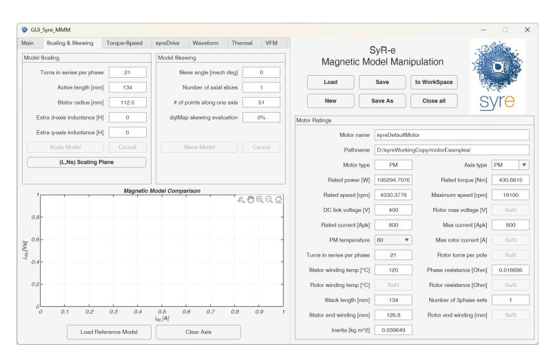

Figure 6.2: Scaling and skewing tab in MMM GUI

#### 6.3.2 Computation of the Inductance Maps

The incremental and apparent inductance maps can be useful for some control algorithms. The former are computed as the gradient of flux linkage divided by current gradient, while the latter are computed as the ratio between the armature flux linkage and the current for each axis, together with the PM flux linkage function of the quadrature current.

#### 6.3.3 Computation of the Inverse Model

Inverse flux maps express currents and torque function of the dq flux linkages and are useful for the dynamic model simulation. The results are rectangular maps in the (λd, λq) domain, so a data loss at the borders is accepted. The process can be performed both for dq and dqθ models.

## 6.4 Scaling and Skewing Flux Maps

The scaling and skewing procedure allows the computation of similar motors with very limited computational effort, since no FEA simulations are performed. The two operations are controlled from the dedicated tab in the MMM GUI, reported in Figure [6.2.](#page-32-4)

The two operations cannot be done in parallel. It is possible to start editing the parameters and press the button for computation to see the results. Then the motor must be saved (not Save, but Save As) or it is possible to come back to the original model with the button Cancel.

Further information about the scaling and skewing procedure can be found [here](http://hdl.handle.net/11583/2940072) and here.

## 6.4.1 Motor Scaling

The parameters that can be changed with scaling procedure are:

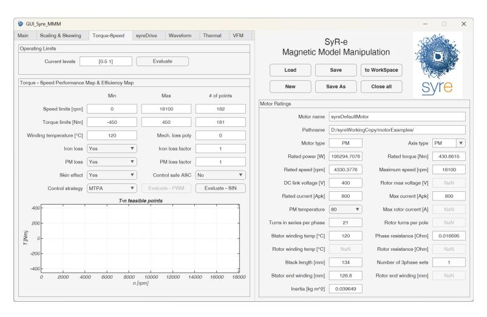

Figure 6.3: Torque-Speed tab of MMM GUI

- number of turns in series per phase
- active length
- stator outer radius
- additional inductance (3D effects) on d and/or q axis.

The scaling procedure acts on the dq and dqθ flux maps, iron loss maps and demagnetization limit. The AC model is deleted, but a new motor is saved, with the FEMM model, so further FEA simulations can be performed.

It is also possible to compute a performance map function of stack length and number of turns and constant inverter limits, by selecting Scaling Map. This features enables the optimization of the selected design.

## 6.4.2 Motor Skewing

The parameters that must be selected are the skew angle and the number of axial slices. If the dqθ model is loaded, so torque ripple is computed. Further details can be found [here.](http://hdl.handle.net/11583/2940072)

## 6.5 Torque-Speed Computations

The computation of the torque-speed behaviors of the motor are done in the dedicated tab, reported in Figure [6.3.](#page-33-3)

There are two procedures that can be followed, to get the operating limits and the efficiency maps.

#### 6.5.1 Operating Limit Computation

The operating limits computation is a very fast and simple procedure that identify the operative limits function of the speed, given the voltage and current limits and neglecting all the loss terms except for the phase resistance.

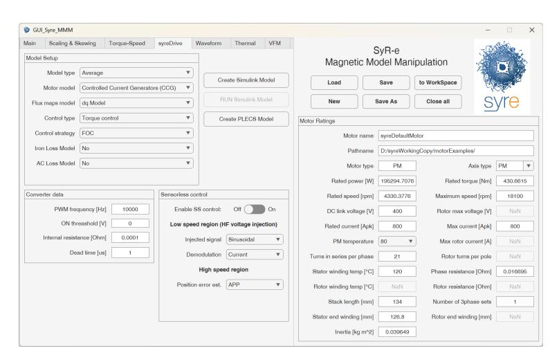

Figure 6.4: syreDrive tab of the MMM GUI

Current limits can be set from the input window in per-unit of the rated current, while the voltage limit is taken from the DC link voltage, without margin.

The results of the computation are torque, power, current, voltage and flux linkage function of speed, together with the control locus on the (id, iq) plane.

#### 6.5.2 Efficiency Map Computation

The efficiency map computation is more complete and heavy than the operating limits computation. In this case, a regular grid on the (T, n) plane is defined and explored. Copper loss are always considered (also at temperature different from the rated) and it is possible to account also for iron loss, PM loss, AC loss and mechanical loss. The first three terms are related to the loaded model, and for iron and PM loss, it is also possible to define a correction factor. Dealing with the mechanical loss, it is defined as a polynomial function of the speed in rpm. The control strategy can be selected (maximum efficiency or MTPA) and voltage limit is taken from the DC link voltage without margins.

The results are matrices function of torque and speed that reports all the loss terms, the current (phase and magnetizing), voltage and efficiency of the motor.

Further information on the procedure can be found [here](http://hdl.handle.net/11583/2901412) and [here.](https://hdl.handle.net/11583/2972970)

## 6.6 Export to Dynamic Model Simulator

The export to dynamic model in Simulink is a feature called syreDrive and it is controlled from the dedicated tab of the MMM GUI, reported in Figure [6.4.](#page-34-2)

From the tab, it is possible to select:

- type of model: Average or Instantaneous model for the inverter;
- type of motor model: if Current-Controlled Generators (CCG) or through dedicated SimScape Electrical block (FEM-parametrized PMSM);
- type of control: if current, torque or speed control;

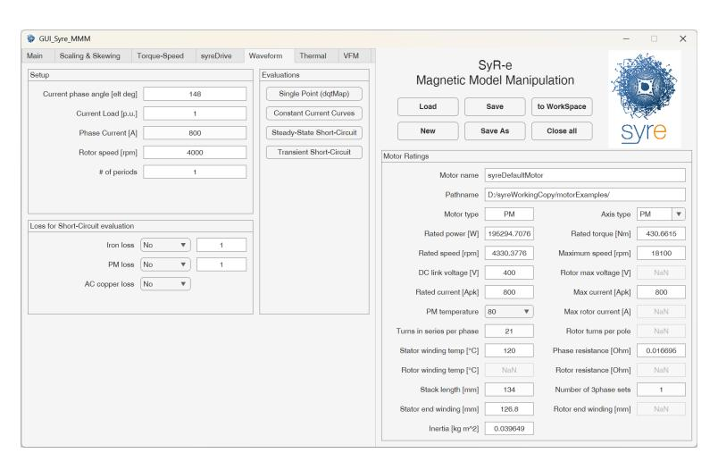

Figure 6.5: Waveform tab of the MMM GUI

- type of motor flux maps: if fundamental (based on dq maps) or with harmonics (based on dqθ maps);
- converter data, like ON threshold and internal resistance of the modules and the dead time;
- loss component to be considered (iron and AC loss);
- type of sensorless control, if needed.

At the moment, the export is done in Matlab/Simulink and PLECS.

## 6.7 Waveform Computation

The waveform tab, reported in Figure [6.5,](#page-35-1) collect two post-processing that allows to get waveform of the single operating point and the transient short-circuit evolution.

The inputs are similar to the Simulation tab of the main GUI, and two buttons define the two elaboration and 4 evaluations can be performed:

- Single point waveform computation from dqθ maps;
- Plot constant current curves function of the current angle;
- Compute the steady-state short-circuit curve, and so steady-state dq current and torque function of the rotor speed with the motor terminals closed in short-circuit;
- Compute the transient short-circuit waveform during a symmetric three-phase short-circuit (Active Short Circuit or ASC), and so instantaneous currents, flux linkages and torque function of the time, starting from the selected pre-fault conditions. Further details available [here.](http://hdl.handle.net/11583/2940061)

# Working without GUIs

It is possible to use SyR-e scripts without GUI. This is usually done from Octave users or expert users that need to run automatic routines. In general is always possible to launch functions that are in the call-back of the GUIs, but in some cases, it could be difficult to run some data check. It is always needed to load the motor model and resolve the back-compatibility issues. Here a (non complete) list of functions useful to operate with SyR-e without GUIs:

- setupPath : add all the folders needed to operate with SyR-e.
- OpenSaveOCT : open a motor model, edit some fields and save it.
- OptimizeOCT : launch the optimization process.
- SimulateOCT : launch FEA simulations
- eval operatingPoint : evaluation of the single operating point with FEA.
- eval fluxMap : evaluation of flux maps with FEA.
- MMM load : create motorModel structure from SyR-e file
- MMM eval AOA : compute control trajectories.
- MMM scale : scale motor model.
- MMM skew : skew motor model.
- MMM eval inverseModel dq : evaluate the inverse model.
- MMM eval shortCircuitTransient : evaluate the transient short-circuit.
- MMM eval OpLim : evaluate the operating limits.
- MMM MaxTw : evaluate the efficiency map.

## 7.1 Custom Features

In the main SyR-e repository is included the folder syreCustomFeatures. This path and all the subfolders are added to the Matlab path as all the other SyR-e functions. Here it is possible to add custom functions to operate with SyR-e scripts and do extra post-processing. There are two examples included in the SyR-e release, that deals with additional post-processing of operating point simulation and a benchmark for timing, that is also an example of scripting.

In general this function are not included in the GUI environment, but can be used as standard Matlab functions.

#### 7.1.1 Single Point additional Post-Processing

This feature add some extra post-processing to the results of the single point evaluation. There are two functions that can be launched:

- plot FFT singt : compute and plot the FFT of torque and dq flux linkage waveform;
- plot vectorDiagram singt : plot the vector diagram of the simulated point.

#### 7.1.2 Automatic SyR-e Execution

This folder contain the script autoSyRe TimingTest, that launch some FEAfix simulations and a flux maps, recording the computational time on a logfile. This could be also used as example of scripting using SyR-e functions.

## 7.1.3 syrmDesignExplorer

This additional GUI allows to manipulate the data from the (x, b) design plane.

# Acknowledgements

SyR-e was made possible thanks to the contribution of several colleagues, students and friends that collaborated to the development of the project.

A special credit goes to Irene Bedino, author of the original design of the SyR-e logo.

# Contacts and References

SyR-e is an open source project, originally born from a cooperation between Politecnico di Bari and Politecnico di Torino. During the years, several professors, researchers and students contribute to the project.

At the moment, SyR-e is mainly maintained from the Power Electronics Innovation Center (PEIC) members, at the Politecnico di Torino [\(PEIC@PoliTO\)](http://www.peic.polito.it/expertise/electrical_machines_design).